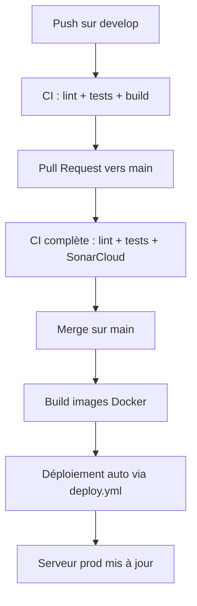

# 📰 Documentation de déploiement – Lorem News

Cette documentation décrit en détail les étapes nécessaires pour déployer **Lorem News** en **local** et en **production**, ainsi que le fonctionnement de l’intégration continue et du déploiement continu (**CI/CD**) via **GitHub Actions**.

---

## 1. Déploiement en local (mode développement)

### 1.1 Prérequis
Avant de démarrer, assurez-vous d’avoir installé :
- **Docker** et **Docker Compose**
- **Git**

Vous devez également configurer les fichiers d’environnement :

- `./.env`  
  Contient les variables globales (DB, pgAdmin, secrets).  

- `./frontend/.env`  
  Exemple :  
  ```env
  AUTH_SECRET="" # Added by `npx auth`. Read more: https://cli.authjs.dev
  NEXTAUTH_URL=http://localhost
  AUTH_URL=http://localhost
  API_URL=http://nginx
  ```

- `./backend/.env`  
  Exemple :  
  ```env
  ###> symfony/framework-bundle ###
  APP_ENV=dev | prod
  APP_SECRET=
  ###< symfony/framework-bundle ###

  ###> doctrine/doctrine-bundle ###
  DATABASE_URL="postgresql://user:mdp@db:5432/bdd?serverVersion=16&charset=utf8"
  ###< doctrine/doctrine-bundle ###

  ###> lexik/jwt-authentication-bundle ###
  JWT_SECRET_KEY=%kernel.project_dir%/config/jwt/private.pem
  JWT_PUBLIC_KEY=%kernel.project_dir%/config/jwt/public.pem
  JWT_PASSPHRASE=
  ###< lexik/jwt-authentication-bundle ###

  ###> nelmio/cors-bundle ###
  CORS_ALLOW_ORIGIN='^https?://(localhost|127\.0\.0\.1)(:[0-9]+)?$'
  ###< nelmio/cors-bundle ###
  ```

---

### 1.2 Lancement
Pour démarrer l’environnement local avec hot-reload (frontend + backend), exécutez :  
```bash
docker compose -f docker-compose.dev.yml up -d --build
```

---

### 1.3 Services accessibles
Une fois les conteneurs démarrés :
- **Frontend (Next.js)** : [http://localhost](http://localhost)  
- **API Symfony (via Nginx)** : [http://localhost:8080](http://localhost:8080)  
- **pgAdmin** : [http://localhost:89](http://localhost:89)  
- **PostgreSQL** : port `5432`  

---

### 1.4 Vérification et logs
```bash
docker ps
docker logs -f lorem_news-nginx
docker logs -f lorem_news-frontend
docker logs -f lorem_news-php
```

---

### 1.5 Mise à jour du projet
Pour récupérer les dernières modifications et reconstruire :  
```bash
git pull
docker compose -f docker-compose.dev.yml up -d --build
```

---

## 2. Déploiement en production

### 2.1 Prérequis
- Un **serveur VPS** ou dédié avec **Docker** et **Git** installés.  
- Les mêmes fichiers `.env` configurés que pour le développement, mais adaptés à la production (secrets, URLs publiques, CORS…).  

---

### 2.2 Lancement
Sur le serveur :  
```bash
docker compose -f docker-compose.prod.yml up -d --build
```

---

### 2.3 Services accessibles
- **Frontend** : http://`IP_SERVEUR`  
- **API Symfony** : http://`IP_SERVEUR`:8080  
- **pgAdmin** : http://`IP_SERVEUR`:89  

---

### 2.4 Vérification
```bash
docker ps
docker logs -f lorem_news-nginx
docker logs -f lorem_news-frontend
docker logs -f lorem_news-php
```

---

## 3. Entrypoint backend (automatisation)

Un script `entrypoint.sh` est fourni pour automatiser l’initialisation du backend :  

```bash
#!/bin/bash

# Exécuter composer install si le dossier vendor n'existe pas
if [ ! -d "vendor" ]; then
  composer install --no-interaction --optimize-autoloader
  php bin/console doctrine:migrations:migrate --no-interaction

  php bin/console doctrine:database:create --env=test --if-not-exists
  php bin/console doctrine:migrations:migrate --env=test -n
fi

# Exécuter génération clés JWT si répertoire n'existe pas
if [ ! -d "config/jwt" ]; then
  php bin/console lexik:jwt:generate-keypair
fi

# Lancer PHP-FPM
php-fpm
```

Ce script garantit que :
- Les dépendances Symfony sont installées.  
- Les migrations sont appliquées.  
- Les clés JWT sont générées si nécessaires.  
- PHP-FPM démarre correctement.  

---

## 4. Intégration Continue & Déploiement Continu (CI/CD)

Le projet utilise **GitHub Actions** pour automatiser :  
- **Les tests** (unitaires, intégration, end-to-end).  
- **L’analyse de code** (PHPStan, SonarCloud, ESLint).  
- **Le build des images Docker**.  
- **Le déploiement automatique en production**.  

---

### 4.1 Workflows GitHub Actions

#### 🔹 Déploiement (`deploy.yml`)
- Déclenché sur **push sur `main`**.  
- Étapes :  
  1. Connexion au serveur via SSH.  
  2. Récupération des dernières images Docker.  
  3. Redémarrage avec :  
     ```bash
     docker compose pull
     docker compose up -d --build
     ```

---

#### 🔹 Frontend (Next.js)
- **`frontend-develop.yml`**  
  - Déclenché sur **push sur `develop`**.  
  - Exécute lint + tests unitaires (Vitest) + build.  

- **`frontend-main.yml`**  
  - Déclenché sur **push sur `main`**.  
  - Exécute lint + tests unitaires + build.  

---

#### 🔹 Backend (Symfony + API Platform)
- **`backend-develop.yml`**  
  - Déclenché sur **push sur `develop`**.  
  - Exécute lint + tests PHPUnit + analyse PHPStan + vérifie les migrations DB.  

- **`backend-main.yml`**  
  - Déclenché sur **push sur `main`**.  
  - Exécute lint + tests + analyse qualité (SonarCloud).   

---

### 4.2 Cycle complet CI/CD
1. **Push sur `develop`** → tests et builds (frontend & backend).  
2. **Pull Request vers `main`** → CI complète (lint + tests + SonarCloud).  
3. **Merge sur `main`** → build des images Docker + publication + déploiement auto.  

---

## 5. Schéma du workflow CI/CD



---

## 6. Bonnes pratiques de maintenance

- Vérifier régulièrement les logs :  
  ```bash
  docker compose logs -f
  ```
- Mettre à jour les dépendances via GitHub Actions (tests automatiques garantissent la stabilité).  
- Surveiller la qualité du code avec **SonarCloud**.  
- Toujours passer par des **PR vers `main`** pour déclencher le pipeline complet.  

---

## 7. Résumé

- **Local** → `docker-compose.dev.yml` (hot-reload, debug).  
- **Production** → `docker-compose.prod.yml` (images optimisées).  
- **CI/CD** → GitHub Actions pour la qualité, les tests, le build et le déploiement.  
- **Automatisation** → déploiement auto après merge sur `main`.  

✅ Cette documentation couvre l’ensemble du cycle de vie : du développement local au déploiement automatisé en production.
